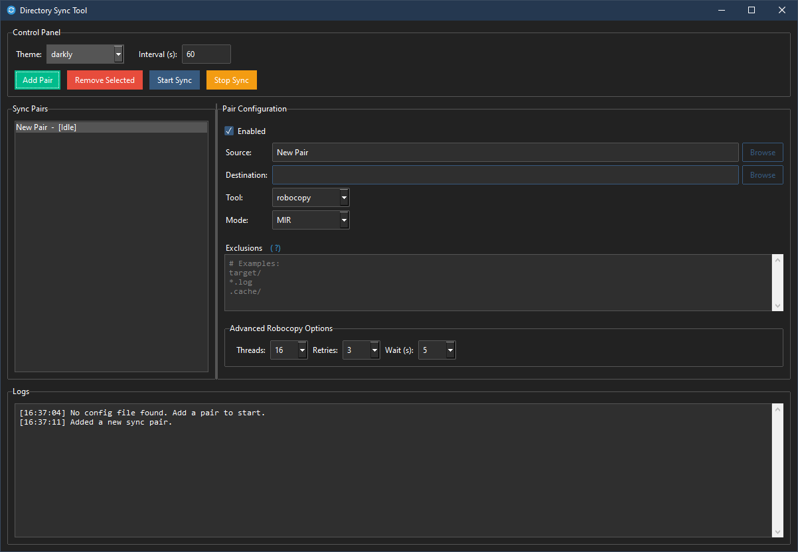

# Directory Sync Tool

A modern, user-friendly directory synchronization tool with support for both **robocopy** and **rclone** backends.

<p align="center">
  
</p>

## Features

- **Modern UI**: Built with ttkbootstrap for a contemporary look and feel
- **Multiple Sync Tools**: Support for both robocopy (local sync) and rclone (cloud sync)
- **Theme Support**: Multiple themes available with dynamic switching
- **Progress Tracking**: Real-time progress meter and detailed logging
- **Rust Project Support**: Automatic cargo clean for Rust projects
- **Thread-Safe**: Background sync operations with thread-safe GUI updates
- **Configuration Management**: Save/load sync configurations
- **Flexible Modes**: MIR, E-Copy modes for robocopy; sync, copy modes for rclone

## Installation

### Prerequisites

- Python 3.7 or higher
- For robocopy: Windows (included with Windows)
- For rclone: Download from [rclone.org](https://rclone.org/) and add to PATH

### Install Dependencies

```bash
pip install -r requirements.txt
```

### Optional: Install ttkbootstrap for Modern UI

```bash
pip install ttkbootstrap
```

If ttkbootstrap is not installed, the application will fallback to standard tkinter with a dark theme.

## Usage

### Starting the Application

```bash
python main.py
```

### Adding Sync Pairs

1. Click "Add Pair" to create a new sync pair
2. Configure the following for each pair:
   - **Enabled**: Toggle to enable/disable the pair
   - **Source**: Source directory path
   - **Destination**: Destination directory path
   - **Tool**: Choose between `robocopy` or `rclone`
   - **Mode**: 
     - For robocopy: `MIR` (mirror) or `E-Copy` (copy subdirectories)
     - For rclone: `sync` or `copy`

### Configuration

- **Interval**: Set sync interval in seconds (default: 60)
- **Theme**: Choose from available themes
- **Save Config**: Save current configuration to `config.json`

### Sync Operations

- **Start Sync**: Begin the sync process
- **Stop Sync**: Stop the sync process and terminate any running operations
- **Progress**: Monitor sync progress with the circular progress meter
- **Log**: View detailed sync logs in the scrollable log area

## Configuration File

The application saves configuration in `config.json`:

```json
{
    "interval": "60",
    "theme": "darkly",
    "pairs": [
        {
            "source": "C:\\Source\\Project1",
            "destination": "D:\\Backup\\Project1",
            "tool": "robocopy",
            "mode": "MIR",
            "enabled": true
        }
    ]
}
```

## Robocopy vs Rclone

### Robocopy (Windows)
- **Best for**: Local directory synchronization
- **Modes**:
  - `MIR`: Mirror mode - makes destination identical to source
  - `E-Copy`: Copy subdirectories including empty ones
- **Validation**: Verifies source directory exists
- **Features**: Multi-threaded, restartable, preserves attributes

### Rclone (Cross-platform)
- **Best for**: Cloud storage synchronization
- **Modes**:
  - `sync`: Make destination identical to source
  - `copy`: Copy files from source to destination
- **Validation**: Skips local path validation (supports cloud paths)
- **Features**: Multi-threaded, supports 40+ cloud providers

## Rust Project Support

The application automatically detects Rust projects (directories containing `Cargo.toml`) and runs `cargo clean` before synchronization to reduce sync time by excluding build artifacts.

## Thread Safety

- Sync operations run in background threads
- GUI updates are thread-safe using queue-based communication
- Safe process termination when stopping sync operations

## Error Handling

- Graceful handling of invalid configurations
- Automatic fallback to defaults on configuration errors
- Detailed error logging with timestamps
- Input validation for paths and intervals

## Building Executable

To create a standalone executable:

```bash
pip install pyinstaller
pyinstaller --onefile --windowed --icon=DirectorySync.ico main.py
```

## File Structure

```
directory-sync-tool/
├── main.py                 # Application entry point
├── gui.py                  # GUI management and event handling
├── sync_manager.py         # Background sync operations
├── requirements.txt        # Python dependencies
├── config.json            # Configuration file (created at runtime)
├── config_example.json    # Example configuration
├── DirectorySync.ico      # Application icon
└── README.md              # This file
```

## Troubleshooting

### Common Issues

1. **rclone not found**: Ensure rclone is installed and added to system PATH
2. **Permission errors**: Run as administrator for system directories
3. **Theme not loading**: Install ttkbootstrap for modern themes
4. **Sync failures**: Check log area for detailed error messages

### Performance Tips

- Use appropriate thread counts for your system
- For large directories, consider using filters
- Monitor system resources during sync operations
- Use MIR mode carefully as it deletes files not in source

## License

This project is open source. See the license file for details.

## Contributing

1. Fork the repository
2. Create a feature branch
3. Make your changes
4. Submit a pull request

## Support

For issues and questions, please check the log output and ensure all prerequisites are met.
